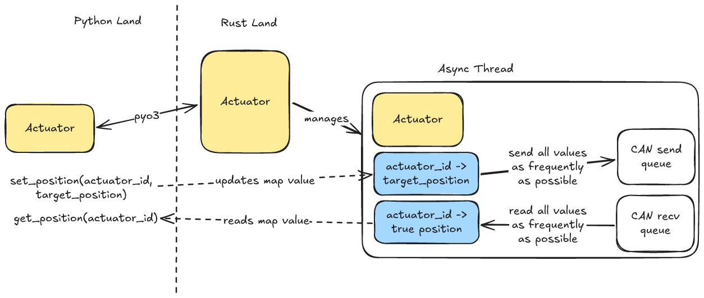

# actuator

Defines a package to make it easy and performant to control actuators.

## Getting Started

See the documentation [here](https://docs.kscale.dev/software/actuators/overview) for instructions on getting started with this package.
